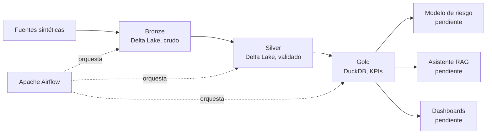

# Gemelo Digital Financiero

Plataforma de Ingeniería de Datos que construye un gemelo digital financiero personal: un sistema capaz de analizar el comportamiento financiero de un usuario, calcular indicadores de riesgo, simular escenarios hipotéticos, y responder preguntas en lenguaje natural sobre su salud financiera.

[](https://github.com/nox-sudo/digital-twin-bbva/actions/workflows/ci.yml)


Path Data Engineering — BBVA | Universidad Tecmilenio
Proyecto individual, Julio–Noviembre 2026 · Mentor: Oscar Daniel Florín Beltrán

---

## Índice

- [Arquitectura](#arquitectura)
- [Stack tecnológico](#stack-tecnológico)
- [Estructura del proyecto](#estructura-del-proyecto)
- [Cómo correrlo](#cómo-correrlo)
- [Pruebas y CI/CD](#pruebas-y-cicd)
- [Datos y KPIs](#datos-y-kpis)
- [Estado del proyecto](#estado-del-proyecto)
- [Documentación adicional](#documentación-adicional)

---

## Arquitectura

El proyecto sigue el patrón Medallion sobre una arquitectura Lakehouse: los datos se guardan en crudo primero, y se les aplica tipado, limpieza, y agregación de forma incremental a través de capas, en vez de imponer un esquema rígido desde el origen.



Cada capa tiene una responsabilidad distinta:

| Capa | Responsabilidad |
|---|---|
| **Bronze** | Captura y preserva datos crudos tal como llegan. Sin limpieza ni lógica de negocio. Trazabilidad completa (timestamp de ingesta, archivo de origen). |
| **Silver** | Tipado correcto, deduplicación, y validación contra reglas de negocio declaradas en `config/business_rules.yaml`. Motor genérico basado en configuración — agregar una regla no requiere código nuevo. Registros inválidos se aíslan en cuarentena, sin detener el pipeline. |
| **Gold** | KPIs calculados a partir de Silver, en formato normalizado en DuckDB. Catálogo declarado en `config/kpi_catalog.yaml`. |

Diagramas formales (arquitectura de infraestructura y flujo de datos completo) disponibles en Lucid — ver [Documentación adicional](#documentación-adicional).

---

## Stack tecnológico

| Categoría | Herramienta | Justificación |
|---|---|---|
| Lenguaje | Python 3.11 | Estándar de la industria para Data Engineering |
| Entorno | uv | Resolución de dependencias más rápida que pip/venv |
| Procesamiento | PySpark | Procesamiento distribuido, justificado por el volumen de transacciones (115,000+ filas) |
| Almacenamiento Bronze/Silver | Delta Lake | Transacciones ACID y versionado |
| Reglas de calidad | YAML | Reglas de negocio como datos, no como código |
| Base analítica Gold | DuckDB | Motor ligero, sin infraestructura adicional |
| Orquestación | Apache Airflow (LocalExecutor) | Suficiente para esta escala, sin la complejidad de Celery/Redis |
| Infraestructura | Docker Compose | Ambiente reproducible con un comando |
| Almacenamiento objeto | MinIO | S3-compatible, preparado para migración futura |
| Control de versiones | Git, GitHub, GitFlow | `main` / `develop` / `feature/*` |

Decisiones descartadas y por qué: Scala (PySpark cubre lo mismo sin costo de aprendizaje adicional), PyTorch (innecesario para clasificación de riesgo crediticio, XGBoost es el estándar real), Control-M (complejidad innecesaria para un proyecto individual, Airflow cubre los requisitos), CeleryExecutor (requiere Redis y workers distribuidos, sobre-ingeniería a esta escala).

---

## Estructura del proyecto

```
digital-twin-bbva/
├── config/
│   ├── business_rules.yaml       # Reglas de calidad de Silver, declarativas
│   └── kpi_catalog.yaml          # Metadata de los 12 KPIs de Gold
├── src/
│   ├── common/
│   │   ├── spark_session.py      # SparkSession compartido, Docker-ready
│   │   └── logging_utils.py      # Logging estructurado por entidad
│   ├── silver/
│   │   ├── validation.py         # Motor genérico de validación
│   │   └── typing_rules.py       # Tipado específico por entidad
│   └── gold/
│       └── kpi_definitions.py    # Lógica de cálculo de cada KPI
├── dags/
│   └── gemelo_pipeline_dag.py    # DAG de Airflow (DockerOperator)
├── tests/
│   ├── conftest.py
│   └── test_validation.py        # Pruebas del motor de Silver
├── .github/workflows/ci.yml      # Lint, tests, smoke test Bronze→Silver→Gold
├── generate_synthetic_sources.py
├── ingest_bronze.py
├── transform_silver.py
├── transform_gold.py
├── pipeline_summary.py           # Reporte visual HTML de una corrida
├── Dockerfile                    # Imagen del worker (PySpark + Delta)
├── docker-compose.yml            # Airflow, Postgres, MinIO, worker
└── setup.sh                      # Genera .env automáticamente
```

---

## Cómo correrlo

### Requisitos

- Python 3.11 y [uv](https://docs.astral.sh/uv/)
- Java 21 (JDK)
- Docker Desktop (solo si vas a levantar la infraestructura completa)

### Opción A — pipeline directo, sin Docker (más rápido)

```bash
uv sync

uv run python generate_synthetic_sources.py --clientes 500 --meses 12
uv run python ingest_bronze.py --source data/raw_sources --out data/bronze
uv run python transform_silver.py --bronze data/bronze --silver data/silver \
    --quarantine data/silver_quarantine --rules config/business_rules.yaml
uv run python transform_gold.py --silver data/silver --out data/gold/kpis.duckdb \
    --catalog config/kpi_catalog.yaml
```

Corre de extremo a extremo en menos de 2 minutos. Para ver un resumen visual del resultado:

```bash
uv run python pipeline_summary.py
```

### Opción B — infraestructura completa (Airflow, MinIO, worker en Docker)

```bash
bash setup.sh          # genera .env automáticamente, sin edición manual
docker compose up --build -d
```

- Airflow: `http://localhost:8080` (usuario `admin`, contraseña `admin`)
- Consola de MinIO: `http://localhost:9001` (`minioadmin` / `minioadmin`)

Disparar el pipeline completo desde Airflow:

```bash
docker compose exec airflow-webserver airflow dags unpause gemelo_digital_financiero_pipeline
docker compose exec airflow-webserver airflow dags trigger gemelo_digital_financiero_pipeline
```

---

## Pruebas y CI/CD

```bash
uv run pytest tests/ -v
```

El workflow de GitHub Actions (`.github/workflows/ci.yml`) corre en cada Pull Request hacia `develop` o `main`, con 4 jobs — los primeros 3 en paralelo:

| Job | Qué valida |
|---|---|
| `lint` | flake8 y black |
| `docker-compose-validate` | Sintaxis de `docker-compose.yml`, sin build de imágenes |
| `unit-tests` | Motor de validación de Silver (pytest) |
| `pipeline-smoke-test` | Pipeline completo Bronze → Silver → Gold con volumen reducido, parametrizable vía `workflow_dispatch` |

---

## Datos y KPIs

5 entidades sintéticas (Faker + NumPy, semillas fijas para reproducibilidad): `clientes`, `cuentas`, `catalogo_productos`, `cetes_inversiones`, `transacciones` (6 tipos de movimiento). Volumen de referencia: 500 clientes, 979 cuentas, 115,797 transacciones.

El esquema completo, con tipo de dato y regla de calidad por columna, está documentado en el diccionario de datos — ver [Documentación adicional](#documentación-adicional).

Catálogo de 12 KPIs en 5 categorías (ingresos, gastos, ahorro y liquidez, riesgo y endeudamiento, comportamiento transaccional), calculados en Gold y almacenados en formato normalizado en DuckDB. El KPI `probabilidad_impago` está declarado en el catálogo con valor `NULL` hasta que exista el modelo de riesgo crediticio.

---

## Estado del proyecto

- [x] Generador de datos sintéticos reproducible (6 tipos de transacción)
- [x] Capa Bronze — ingesta en Delta Lake con trazabilidad
- [x] Capa Silver — motor de validación genérico, patrón de cuarentena
- [x] Infraestructura Docker Compose — Airflow, Postgres, MinIO, worker
- [x] DAG de Airflow corriendo end-to-end de forma automatizada
- [x] CI/CD — 4 jobs, lint + tests + validación de infraestructura + smoke test
- [x] Pruebas de robustez con inyección deliberada de datos sucios (5 escenarios)
- [x] Capa Gold — catálogo de 12 KPIs en DuckDB
- [x] Diccionario de datos formal
- [ ] Modelo predictivo de riesgo crediticio
- [ ] Simulador de escenarios Monte Carlo
- [ ] Asistente conversacional RAG local (Ollama + Llama 3 + LangChain)
- [ ] Dashboards (Streamlit — decisión documentada, construcción pendiente)
- [ ] Feature Store (diferido hasta construir el modelo de riesgo)

---

## Documentación adicional

- Reporte técnico completo (arquitectura, decisiones de diseño, hallazgos de robustez) — Google Drive
- Diccionario de datos formal — Google Drive
- Diagrama de arquitectura de infraestructura — Lucid
- Diagrama de flujo de datos end-to-end — Lucid

Enlaces disponibles en el reporte técnico principal del proyecto.

---

Este es un proyecto académico individual. El repositorio es privado durante el desarrollo del semestre.
