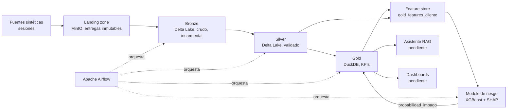

# Gemelo Digital Financiero

Plataforma de Ingeniería de Datos que construye un gemelo digital financiero personal: un sistema capaz de analizar el comportamiento financiero de un usuario, calcular indicadores de riesgo, simular escenarios hipotéticos, y responder preguntas en lenguaje natural sobre su salud financiera.

[](https://github.com/nox-sudo/digital-twin-bbva/actions/workflows/ci.yml)


Path Data Engineering — BBVA | Universidad Tecmilenio
Proyecto individual, Julio–Noviembre 2026 · Mentor: Oscar Daniel Florín Beltrán

---

## Índice

- [Arquitectura](#arquitectura)
- [Stack tecnológico](#stack-tecnológico)
- [Estructura del proyecto](#estructura-del-proyecto)
- [Cómo correrlo](#cómo-correrlo)
- [Pruebas y CI/CD](#pruebas-y-cicd)
- [Datos y KPIs](#datos-y-kpis)
- [Estado del proyecto](#estado-del-proyecto)
- [Documentación](#documentación)

---

## Arquitectura

El proyecto sigue el patrón Medallion sobre una arquitectura Lakehouse: los datos se guardan en crudo primero, y se les aplica tipado, limpieza, y agregación de forma incremental a través de capas, en vez de imponer un esquema rígido desde el origen.


```mermaid
flowchart LR
    A[Fuentes sintéticas<br/>sesiones] --> L[Landing zone<br/>MinIO, entregas inmutables]
    L --> B[Bronze<br/>Delta Lake, crudo, incremental]
    B --> C[Silver<br/>Delta Lake, validado]
    C --> D[Gold<br/>DuckDB, KPIs]
    D --> FS[Feature store<br/>gold_features_cliente]
    C --> FS
    FS --> E[Modelo de riesgo<br/>XGBoost + SHAP]
    E -->|probabilidad_impago| D
    D --> F[Asistente RAG<br/>pendiente]
    D --> G[Dashboards<br/>pendiente]

    H[Apache Airflow] -.orquesta.-> B
    H -.orquesta.-> C
    H -.orquesta.-> D
    H -.orquesta.-> E
```

Cada capa tiene una responsabilidad distinta:

| Capa | Responsabilidad |
|---|---|
| **Bronze** | Captura y preserva datos crudos tal como llegan. Sin limpieza ni lógica de negocio. Trazabilidad completa (timestamp de ingesta, archivo de origen). |
| **Silver** | Tipado correcto, deduplicación, y validación contra reglas de negocio declaradas en `config/business_rules.yaml`. Motor genérico basado en configuración — agregar una regla no requiere código nuevo. Registros inválidos se aíslan en cuarentena, sin detener el pipeline. |
| **Gold** | KPIs calculados a partir de Silver, en formato normalizado en DuckDB. Catálogo declarado en `config/kpi_catalog.yaml`. Incluye `gold_features_cliente`, el feature store: una fila por cliente que consumen el modelo, el dashboard, el simulador y el asistente. |

Detalle completo de zonas, tareas del DAG y decisiones de diseño en [docs/arquitectura.md](docs/arquitectura.md).

---

## Stack tecnológico

| Categoría | Herramienta | Justificación |
|---|---|---|
| Lenguaje | Python 3.11 | Estándar de la industria para Data Engineering |
| Entorno | uv | Resolución de dependencias más rápida que pip/venv |
| Procesamiento | PySpark | Procesamiento distribuido, justificado por el volumen de transacciones (115,000+ filas) |
| Almacenamiento Bronze/Silver | Delta Lake | Transacciones ACID y versionado |
| Reglas de calidad | YAML | Reglas de negocio como datos, no como código |
| Base analítica Gold | DuckDB | Motor ligero, sin infraestructura adicional |
| Modelado de riesgo | XGBoost, SHAP | Estándar de la industria para clasificación tabular; SHAP hace interpretable cada predicción |
| Orquestación | Apache Airflow (LocalExecutor) | Suficiente para esta escala, sin la complejidad de Celery/Redis |
| Infraestructura | Docker Compose | Ambiente reproducible con un comando |
| Almacenamiento objeto | MinIO | S3-compatible, preparado para migración futura |
| Control de versiones | Git, GitHub, GitFlow | `main` / `develop` / `feature/*` |

Decisiones descartadas y por qué: Scala (PySpark cubre lo mismo sin costo de aprendizaje adicional), PyTorch (innecesario para clasificación de riesgo crediticio, XGBoost es el estándar real), Control-M (complejidad innecesaria para un proyecto individual, Airflow cubre los requisitos), CeleryExecutor (requiere Redis y workers distribuidos, sobre-ingeniería a esta escala).

---

## Estructura del proyecto

```
digital-twin-bbva/
├── config/
│   ├── sesion.yaml               # Parámetros de la sesión de datos (semilla, fecha, volumen)
│   ├── business_rules.yaml       # Reglas de calidad de Silver, declarativas
│   ├── politica_pii.yaml         # Qué datos personales se protegen en Silver, y cómo
│   └── kpi_catalog.yaml          # Metadata de los 12 KPIs de Gold
├── src/
│   ├── common/
│   │   ├── spark_session.py      # SparkSession compartido, Docker-ready
│   │   ├── sesiones.py           # Sesiones de datos: manifest, checksums, reuso
│   │   ├── identificadores.py    # CURP y RFC: construcción y validación (RENAPO/SAT)
│   │   ├── secretos.py           # Lectura de secretos desde entorno o .env
│   │   └── logging_utils.py      # Logging estructurado por entidad
│   ├── silver/
│   │   ├── validation.py         # Motor genérico de validación
│   │   ├── identificadores_spark.py  # Validación de CURP/RFC nativa en Spark
│   │   ├── pii.py                # Hash con sal (HMAC), enmascarado y descarte de PII
│   │   └── typing_rules.py       # Tipado específico por entidad
│   ├── calidad/
│   │   └── registro.py           # Registro histórico: incidencias, perfil de nulos, errores de tipo
│   └── gold/
│       ├── kpi_definitions.py    # Lógica de cálculo de cada KPI
│       └── risk_features.py      # Feature store: construir, persistir y leer features
├── dags/
│   └── gemelo_pipeline_dag.py    # DAG de Airflow (DockerOperator)
├── tests/
│   ├── conftest.py
│   ├── test_validation.py        # Pruebas del motor de Silver
│   ├── test_model.py             # Contrato de carga y predicción del modelo
│   ├── test_features.py          # Persistencia y preparación del feature store
│   ├── test_sesiones.py          # Reproducibilidad y reuso de sesiones de datos
│   ├── test_pii.py               # Identificadores, HMAC Spark == Python, política de PII
│   ├── test_landing.py           # Landing zone (S3 simulado) e ingesta incremental
│   ├── test_calidad.py           # Registro de calidad y valores corruptos sin detener el pipeline
│   └── test_main_cli.py          # Pruebas de enrutamiento del CLI (main.py)
├── docs/
│   ├── arquitectura.md           # Flujo, zonas, DAG y decisiones de diseño
│   ├── diccionario-datos.md      # Columnas, tipos, reglas y tratamiento de PII
│   ├── ejecucion-local.md        # Guía para correr el proyecto en otra máquina
│   ├── seguridad.md              # Secretos, clasificación de datos por capa, auditoría
│   └── technical-debt.md         # Deuda técnica conocida
├── models/                       # Modelo entrenado y gráfico SHAP (se regeneran)
├── .github/workflows/ci.yml      # Lint, tests, smoke test Bronze→Silver→Gold→modelo
├── main.py                       # CLI unico: python main.py <paso> [opciones]
├── generate_synthetic_sources.py
├── publish_landing.py            # Publica la sesión activa como entrega en MinIO
├── ingest_bronze.py              # Ingesta incremental: solo lo no ingerido
├── transform_silver.py
├── transform_gold.py
├── build_features.py             # Feature store en Gold (gold_features_cliente)
├── generate_labels.py
├── train_model.py
├── predict_risk.py
├── quality_report.py             # Reporte del registro histórico de calidad
├── pipeline_summary.py           # Reporte visual HTML de una corrida
├── Dockerfile                    # Imagen del worker (PySpark + Delta)
├── docker-compose.yml            # Airflow, Postgres, MinIO, worker
├── demo.sh                       # Arranque de un comando: levanta todo y corre el DAG
└── setup.sh                      # Genera .env automáticamente (lo invoca demo.sh)
```

---

## Cómo correrlo

### Opción A — un comando, con Docker (recomendada para correrlo en otra máquina)

Solo requiere Docker; no hace falta Python, Java ni Spark en la máquina.

```bash
bash demo.sh
```

Genera `.env`, construye el worker, levanta Airflow, Postgres y MinIO, dispara el DAG y muestra el avance tarea por tarea hasta terminar. Requisitos, comandos adicionales (`pipeline`, `reporte`, `limpiar`), instrucciones para Windows y problemas comunes: [docs/ejecucion-local.md](docs/ejecucion-local.md).

- Airflow: `http://localhost:8080` y consola de MinIO: `http://localhost:9001`. Las credenciales se generan al azar por máquina en `.env` (nunca en el repo) y `demo.sh` las muestra al terminar. Detalle en [docs/seguridad.md](docs/seguridad.md).

### Opción B — pipeline directo, sin Docker (desarrollo)

Requiere Python 3.11, [uv](https://docs.astral.sh/uv/) y Java 21 (JDK).

```bash
uv sync

uv run python generate_synthetic_sources.py   # parámetros de config/sesion.yaml
uv run python ingest_bronze.py --source data/raw_sources --out data/bronze
uv run python transform_silver.py --bronze data/bronze --silver data/silver \
    --quarantine data/silver_quarantine --rules config/business_rules.yaml
uv run python transform_gold.py --silver data/silver --out data/gold/kpis.duckdb \
    --catalog config/kpi_catalog.yaml
uv run python build_features.py
uv run python generate_labels.py --silver data/silver
uv run python train_model.py
uv run python predict_risk.py
```

También existe `main.py` como punto de entrada único: expone cada paso como
subcomando (`generate`, `bronze`, `silver`, `gold`, `features`, `labels`,
`train-model`, `predict-risk`), reenviando las mismas opciones al script real. Por ejemplo,
las primeras dos líneas de arriba son equivalentes a:

```bash
uv run python main.py generate --clientes 500 --meses 12
uv run python main.py bronze --source data/raw_sources --out data/bronze
```

Ver las opciones de un paso puntual: `uv run python main.py <paso> --help`.

Corre de extremo a extremo en menos de 2 minutos. Para ver un resumen visual del resultado:

```bash
uv run python pipeline_summary.py
```


---

## Pruebas y CI/CD

```bash
uv run pytest tests/ -v
```

El workflow de GitHub Actions (`.github/workflows/ci.yml`) corre en cada Pull Request hacia `develop` o `main`, con 4 jobs — los primeros 3 en paralelo:

| Job | Qué valida |
|---|---|
| `lint` | flake8 y black |
| `docker-compose-validate` | Sintaxis de `docker-compose.yml` con un `.env` generado por `setup.sh`, y shellcheck de `setup.sh`/`demo.sh` |
| `unit-tests` | Motor de validación de Silver (pytest) |
| `pipeline-smoke-test` | Pipeline completo Bronze → Silver → Gold → modelo de riesgo con volumen reducido (100 clientes, 2 meses), parametrizable vía `workflow_dispatch`; verifica los 12 KPIs, el feature store, y que `probabilidad_impago` tenga valor en [0, 1] para todos los clientes |

---

## Datos y KPIs

5 entidades sintéticas (Faker + NumPy): `clientes`, `cuentas`, `catalogo_productos`, `cetes_inversiones`, `transacciones` (6 tipos de movimiento). Volumen de referencia: 500 clientes, 979 cuentas, 117,081 transacciones.

**Sesiones de datos reproducibles.** Cada conjunto generado es una sesión identificada por sus parámetros (`config/sesion.yaml`: semilla, fecha de referencia, clientes, meses), por ejemplo `s42_20260930_500c_12m`. Todas las fechas se calculan contra la fecha de referencia, nunca contra el reloj del sistema, así que los mismos parámetros producen exactamente los mismos archivos cualquier día y en cualquier máquina; el CI lo verifica comparando checksums. La sesión se guarda en `data/sesiones/<id>/` con un `manifest.json` (parámetros, conteos, SHA-256 de cada archivo); si ya existe y está íntegra, el pipeline la reutiliza en vez de regenerarla, y si algún archivo fue alterado, lo detecta y la regenera. `data/raw_sources/` apunta a la sesión activa mediante hard links, y cada fila de Bronze guarda su `_sesion_id`. Las sesiones viven en disco, fuera de los contenedores: sobreviven a `docker compose down` y a `demo.sh limpiar`.

**Landing zone e ingesta incremental.** Cada sesión se publica en MinIO como una *entrega* inmutable (`landing/entregas/<id>/`, con SHA-256 por objeto y un manifest escrito al final). Una entrega solo sube lo que no llegó idéntico antes: `bash demo.sh nueva-entrega` simula que llega el mes siguiente, y su entrega trae solo ese mes de transacciones (las sesiones son extensibles: cada mes tiene su propia semilla, así que agregar uno no altera los anteriores). Bronze ya no se sobrescribe: ingiere solo los archivos que no tiene, según un registro de control por archivo y checksum (`data/bronze/_control_ingesta.jsonl`), y acumula las versiones de cada snapshot; Silver se queda con la más reciente por llave. Si Bronze se pierde, se reconstruye completo desde la landing zone.

El esquema completo, con tipo de dato, regla de calidad y tratamiento de PII por columna, está en [docs/diccionario-datos.md](docs/diccionario-datos.md).

Catálogo de 12 KPIs en 5 categorías (ingresos, gastos, ahorro y liquidez, riesgo y endeudamiento, comportamiento transaccional), calculados en Gold y almacenados en formato normalizado en DuckDB. El KPI `probabilidad_impago` se calcula en Gold como `NULL` y el modelo de riesgo (XGBoost) lo completa en el último paso del pipeline (`predict_risk.py`).

`gold_features_cliente` (misma base DuckDB) es el feature store del proyecto: una fila por cliente con los 11 KPIs restantes en columnas, más variables de perfil calculadas desde Silver (edad, antigüedad, número de productos, proporción de retiros). Se persiste en vez de recalcularse en cada consumidor por dos razones: el modelo se entrena y predice sobre exactamente la misma tabla (sin desalineación entre entrenamiento e inferencia), y el dashboard, el simulador y el asistente RAG leen el perfil del cliente sin levantar Spark. Se guarda en forma legible (la categoría de gasto como texto); la codificación one-hot que necesita XGBoost se aplica al entrenar o predecir.

---

## Estado del proyecto

- [x] Generador de datos sintéticos reproducible (6 tipos de transacción)
- [x] Capa Bronze — ingesta en Delta Lake con trazabilidad
- [x] Capa Silver — motor de validación genérico, patrón de cuarentena
- [x] Infraestructura Docker Compose — Airflow, Postgres, MinIO, worker
- [x] DAG de Airflow corriendo end-to-end de forma automatizada
- [x] CI/CD — 4 jobs, lint + tests + validación de infraestructura + smoke test
- [x] Pruebas de robustez con inyección deliberada de datos sucios (5 escenarios)
- [x] Capa Gold — catálogo de 12 KPIs en DuckDB
- [x] Diccionario de datos formal
- [x] Modelo predictivo de riesgo crediticio (XGBoost + SHAP), entrenado dentro del DAG
- [x] Feature store ligero en Gold (`gold_features_cliente`), fuente única de features
- [x] PII sintética (CURP, RFC, teléfono, domicilio) validada y protegida en Silver con hash y enmascarado
- [x] Seguridad base: secretos por máquina fuera del repo, puertos locales, escaneo de secretos en CI
- [x] Sesiones de datos reproducibles, con manifest, checksums y reuso
- [x] Registro histórico de calidad: incidencias por regla, nulos por columna y errores de tipo, sin PII
- [x] Landing zone en MinIO con entregas inmutables e ingesta incremental en Bronze
- [x] Arranque reproducible con un comando en cualquier máquina con Docker (`demo.sh`)
- [ ] Simulador de escenarios Monte Carlo
- [ ] Asistente conversacional RAG local (Ollama + Llama 3 + LangChain)
- [ ] Dashboards (Streamlit — decisión documentada, construcción pendiente)

---

## Documentación

La documentación técnica vive en el repositorio y se actualiza en el mismo PR que el código que describe:

| Documento | Contenido |
|---|---|
| [docs/arquitectura.md](docs/arquitectura.md) | Flujo de punta a punta, zonas, tareas del DAG, configuración y decisiones de diseño con sus alternativas descartadas |
| [docs/diccionario-datos.md](docs/diccionario-datos.md) | Columnas por entidad y capa: tipos, reglas de calidad, tratamiento de PII, KPIs y feature store |
| [docs/seguridad.md](docs/seguridad.md) | Secretos, clasificación de datos por capa, protección de PII, auditoría del repositorio y riesgos aceptados |
| [docs/ejecucion-local.md](docs/ejecucion-local.md) | Cómo correr el proyecto en otra máquina, comandos de `demo.sh` y problemas comunes |
| [docs/technical-debt.md](docs/technical-debt.md) | Deuda técnica conocida, con fecha de última verificación |

Documentos académicos del programa, fuera del repositorio: reporte técnico, bitácora de incidentes y diagramas en Lucid (infraestructura y flujo de datos).

---

Este es un proyecto académico individual. El repositorio es público: no contiene datos ni secretos (ver [docs/seguridad.md](docs/seguridad.md)).
