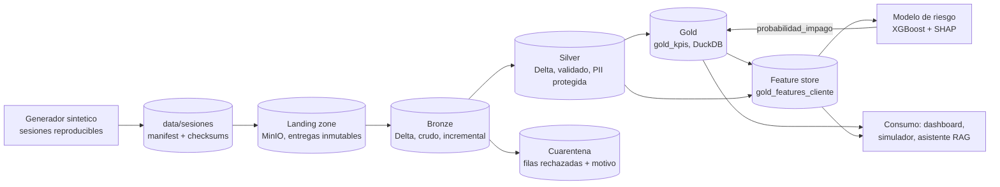

# Arquitectura

Como fluyen los datos de punta a punta, que hace cada zona, y por que se
tomo cada decision de diseno. Para correr el proyecto ver
`docs/ejecucion-local.md`; para el detalle de cada columna,
`docs/diccionario-datos.md`; para secretos y datos personales,
`docs/seguridad.md`.

## Vista general

Airflow orquesta todo el flujo con un DAG (`dags/gemelo_pipeline_dag.py`):
cada tarea lanza un contenedor `worker` efimero con PySpark, Delta Lake y
el codigo del proyecto. Airflow decide cuando y en que orden; el worker
hace el computo.

## Zonas y responsabilidades

| Zona | Donde vive | Responsabilidad | PII |
|---|---|---|---|
| Sesion | `data/sesiones/<id>/` | Fuentes sinteticas con sus parametros y checksums. Inmutable; se reutiliza si ya existe | En claro |
| Landing zone | MinIO, `landing/entregas/<id>/` | Historico de lo que realmente llego. Una entrega solo trae lo que no llego antes | En claro |
| Bronze | `data/bronze/` (Delta) | Registro fiel y acumulativo de lo ingerido, con trazabilidad por fila. Sin limpieza | En claro |
| Cuarentena | `data/silver_quarantine/` (Delta) | Filas que violan una regla de calidad, con el motivo | Protegida |
| Silver | `data/silver/` (Delta) | Datos tipados, deduplicados y validados | Protegida |
| Gold | `data/gold/kpis.duckdb` | 12 KPIs por cliente y feature store | Sin PII |
| Modelo | `models/` | Clasificador de riesgo y grafico de importancia SHAP | Sin PII |

## Tareas del DAG

| # | Tarea | Script | Que hace |
|---|---|---|---|
| 1 | `generar_fuentes_sinteticas` | `generate_synthetic_sources.py` | Genera (o reutiliza) la sesion de `config/sesion.yaml`, mas los meses adicionales que indique el disparo |
| 2 | `publicar_landing` | `publish_landing.py` | Publica la sesion como entrega en MinIO; solo sube lo nuevo |
| 3 | `ingesta_bronze` | `ingest_bronze.py --desde-landing` | Descarga y verifica las entregas pendientes; ingiere solo archivos no ingeridos |
| 4 | `transformacion_silver` | `transform_silver.py` | Tipado, deduplicacion, validacion por reglas, proteccion de PII, cuarentena |
| 5 | `transformacion_gold` | `transform_gold.py` | Calcula los 12 KPIs del catalogo en DuckDB |
| 6 | `construir_features` | `build_features.py` | Persiste `gold_features_cliente` |
| 7 | `generar_etiquetas` | `generate_labels.py` | Etiquetas sinteticas de riesgo para entrenar |
| 8 | `entrenar_modelo` | `train_model.py` | Entrena XGBoost y genera la importancia SHAP |
| 9 | `predict_risk` | `predict_risk.py` | Completa `probabilidad_impago` en Gold |

Todos los pasos tambien se pueden correr sin Airflow con el CLI unico:
`python main.py <paso>` (o `bash demo.sh pipeline` en Docker).

## Configuracion declarativa

El comportamiento del pipeline se cambia editando configuracion, no
codigo:

| Archivo | Controla |
|---|---|
| `config/sesion.yaml` | Semilla, fecha de referencia y volumen de los datos |
| `config/business_rules.yaml` | Reglas de calidad de Silver por entidad |
| `config/politica_pii.yaml` | Que datos personales se protegen en Silver, y como |
| `config/kpi_catalog.yaml` | Metadata de los KPIs de Gold |

## Decisiones de diseno

| Decision | Por que | Alternativa descartada |
|---|---|---|
| Lakehouse con patron Medallion | Conserva el dato crudo para auditoria y reproceso, con calidad creciente por capa | Data warehouse con esquema rigido desde el origen |
| Delta Lake en Bronze y Silver | Escrituras atomicas (ACID), versionado y evolucion de esquema (`mergeSchema`) | Parquet plano: una escritura interrumpida deja la tabla corrupta |
| DuckDB para Gold | Motor analitico sin servidor; suficiente para consultas de consumo | PostgreSQL: un servicio mas sin beneficio a esta escala |
| Validacion declarativa con motor generico y cuarentena | Una regla nueva es una linea de YAML; las filas invalidas se aislan sin detener el pipeline | Validaciones escritas a mano por entidad |
| Sesiones reproducibles ancladas a una fecha de referencia | Los mismos parametros producen los mismos datos cualquier dia y en cualquier maquina | Fechas relativas al reloj del sistema (los datos cambiaban cada dia) |
| Landing zone inmutable + Bronze incremental con registro de control | Historico de lo recibido; reingerir no duplica; Bronze se reconstruye desde la landing zone | Sobrescribir Bronze completo en cada corrida |
| Validacion de CURP/RFC y HMAC como expresiones nativas de Spark | Spark las evalua dentro de la JVM y las optimiza con el resto del plan | UDFs de Python: serializan cada fila hacia otro proceso |
| Proteccion de PII al escribir Silver (hash con sal + enmascarado) | Permite unir y contar clientes sin exponer el dato; la PII en claro queda solo en zonas restringidas | Copiar la PII tal cual a todas las capas |
| Feature store persistido en Gold | Entrenamiento e inferencia leen la misma tabla; dashboard y asistente no necesitan Spark | Recalcular features en cada consumidor |
| Worker separado de Airflow (DockerOperator) | El orquestador no necesita Java ni Spark; el computo escala aparte | Correr Spark dentro del contenedor de Airflow |
| Secretos generados por maquina, fuera del repo | Ninguna credencial compartida ni versionada | Contrasenas fijas en `docker-compose.yml` |

## Como se verifica

| Garantia | Verificacion |
|---|---|
| El pipeline corre de punta a punta | Smoke test de CI: generador, Bronze, Silver, Gold, features y modelo con volumen reducido |
| Los datos son reproducibles | CI regenera la sesion desde cero y compara checksums |
| La ingesta es incremental e idempotente | CI reingiere (no agrega nada) y aplica una entrega nueva (agrega solo su mes) |
| Silver no contiene PII en claro | `transform_silver.py` se detiene si un campo sensible llega a la escritura; CI lo vuelve a revisar |
| CURP/RFC se validan igual en Spark que en Python | `tests/test_pii.py`, 150 casos validos y alterados |
| No hay secretos ni datos en el repo | Escaneo de secretos y de archivos de datos en cada PR |
